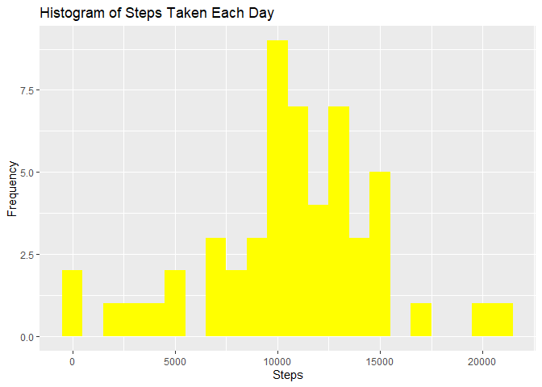
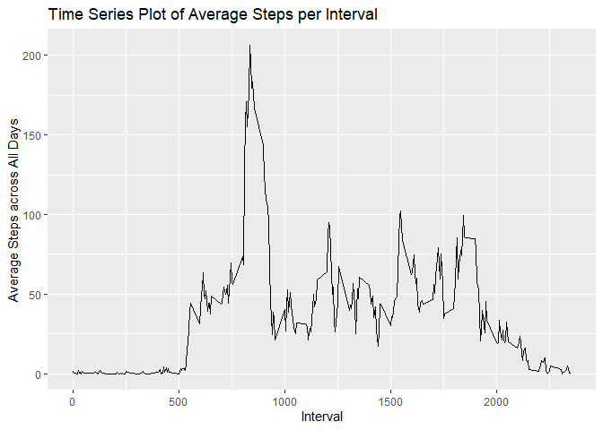
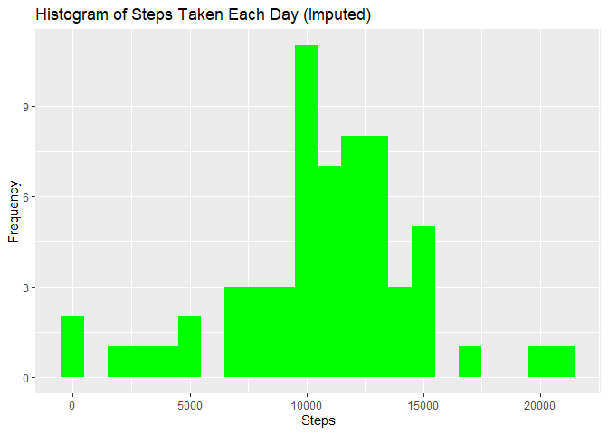
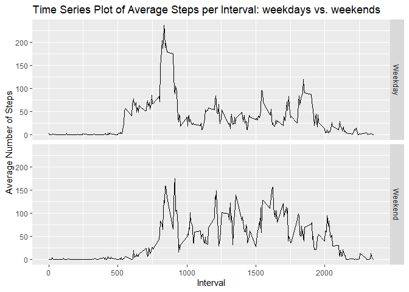

## Loading and preprocessing the data


``` r
knitr::opts_chunk$set(echo = TRUE)
library(ggplot2)

# Load the data
fullData <- read.csv("activity.csv")

# Process/transform the data
fullData$date <- as.Date(fullData$date, "%Y-%m-%d")
```

## What is mean total number of steps taken per day?


``` r
# Calculate the total steps per day
stepsPerDay <- aggregate(steps ~ date, fullData, FUN = sum)

# Create the histogram
g <- ggplot(stepsPerDay, aes(x = steps))
g + geom_histogram(fill = "yellow", binwidth = 1000) + 
  labs(title = "Histogram of Steps Taken Each Day", x = "Steps", y = "Frequency")
```

<!-- -->

``` r
# Mean of steps
stepsMean <- mean(stepsPerDay$steps, na.rm=TRUE)
stepsMean
```

```
## [1] 10766.19
```

``` r
# Median of steps
stepsMedian <- median(stepsPerDay$steps, na.rm=TRUE)
stepsMedian
```

```
## [1] 10765
```

## What is the average daily activity pattern?


``` r
# create average number of steps per 5-min interval
stepsPerInterval <- aggregate(steps ~ interval, fullData, mean)

# Create a time series plot
h <- ggplot(stepsPerInterval, aes(x=interval, y=steps))
h + geom_line() + 
  labs(title = "Time Series Plot of Average Steps per Interval", x = "Interval", y = "Average Steps across All Days")
```

<!-- -->

``` r
# Maximum steps by interval
maxInterval <- stepsPerInterval[which.max(stepsPerInterval$steps), ]
maxInterval
```

```
##     interval    steps
## 104      835 206.1698
```

## Imputing missing values


``` r
# Number of NAs in the original dataset
noMissingValue <- nrow(fullData[is.na(fullData$steps),])
noMissingValue
```

```
## [1] 2304
```

``` r
# My strategy for filling in missing values is to substitute with the average number of steps based on both the 5-minute interval and the day of the week
fullData1 <- read.csv("activity.csv", header=TRUE, sep=",")
fullData1$day <- weekdays(as.Date(fullData1$date))

# create average number of steps per 5-min interval and day
stepsAvg1 <- aggregate(steps ~ interval + day, fullData1, mean)

# Create dataset with all NAs for substitution
nadata <- fullData1[is.na(fullData1$steps),]

# Merge NAs dataset with the average steps based on 5-min interval+weekdays
newdata1 <- merge(nadata, stepsAvg1, by=c("interval", "day"))

# Pull data without NAs
cleanData <- fullData1[!is.na(fullData1$steps),]

# Reorder the new substituted data
newdata2 <- newdata1[,c(5,4,1,2)]
colnames(newdata2) <- c("steps", "date", "interval", "day")

# Merge the new average data (NAs) with the dataset without NAs
mergeData <- rbind(cleanData, newdata2)

# Calculate the total steps per day on the merged data
stepsPerDayFill <- aggregate(steps ~ date, mergeData, FUN = sum)

# Create the histogram
g1 <- ggplot(stepsPerDayFill, aes(x = steps))
g1 + geom_histogram(fill = "green", binwidth = 1000) + 
  labs(title = "Histogram of Steps Taken Each Day (Imputed)", x = "Steps", y = "Frequency")
```

<!-- -->

``` r
# Mean and Median with imputed data
stepsMeanFill <- mean(stepsPerDayFill$steps, na.rm=TRUE)
stepsMeanFill
```

```
## [1] 10821.21
```

``` r
stepsMedianFill <- median(stepsPerDayFill$steps, na.rm=TRUE)
stepsMedianFill
```

```
## [1] 11015
```

## Are there differences in activity patterns between weekdays and weekends?


``` r
# create a new variable/column indicating weekday or weekend
mergeData$DayType <- ifelse(mergeData$day %in% c("Saturday", "Sunday"), "Weekend", "Weekday")

# create table with average steps per time interval across weekday days or weekend days
stepsPerIntervalDT <- aggregate(steps ~ interval+DayType, mergeData, FUN = mean)

# Make the panel plot
j <- ggplot(stepsPerIntervalDT, aes(x=interval, y=steps))
j + geom_line() + 
  labs(title = "Time Series Plot of Average Steps per Interval: weekdays vs. weekends", x = "Interval", y = "Average Number of Steps") + 
  facet_grid(DayType ~ .)
```

<!-- -->
